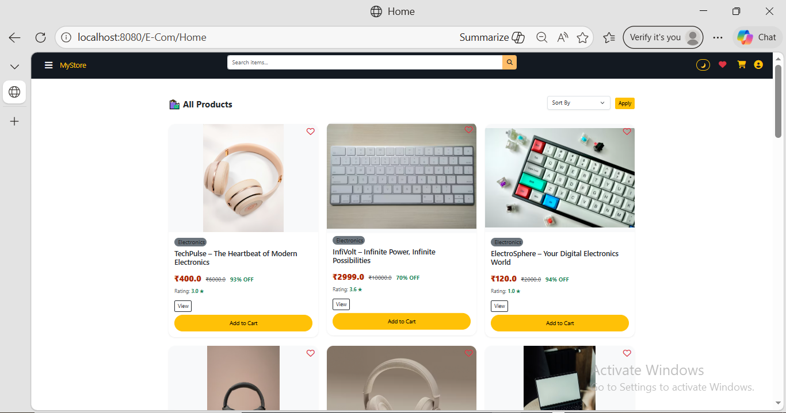
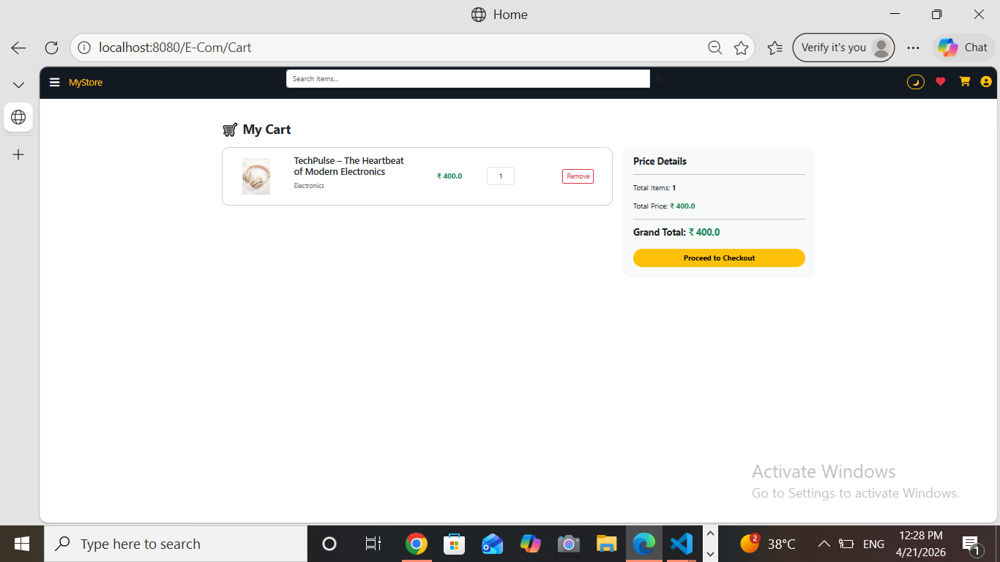

# 🛒 MyStore - Enterprise-Grade E-Commerce Platform (Java MVC)

An advanced E-Commerce web application built with **Java Jakarta EE** and **MySQL**. This project follows the **MVC (Model-View-Controller)** architecture to ensure high scalability and professional code standards.

---

## 📸 Project Gallery

| Home Page | User Dashboard | Admin Panel |
| :---: | :---: | :---: |
|  |  |  |

| Cart System | Product Management | Wishlist View |
| :---: | :---: | :---: |
|  |  |  |

> **Note:** Upload your project screenshots to a folder named `screenshots` in your GitHub repository to display them here.

---

## 🛠️ Technical Architecture

* **Backend:** Java Servlets & JSP (Jakarta EE)
* **Database:** MySQL 8.0 (Relational Schema)
* **Architecture:** MVC Pattern (Separation of Concerns)
* **Frontend:** Responsive UI using HTML5, CSS3, Bootstrap 5, and JavaScript
* **Server:** Apache Tomcat 10+

---

## 👥 User & Admin Roles (RBAC)

The system implements **Role-Based Access Control** to provide distinct functionalities for different users:

### 👤 Customer Features
* **Secure Authentication:** Registration and login with server-side session management.
* **OTP Verification:** 4-digit OTP logic for account creation and password recovery.
* **Shopping Suite:** Real-time Cart management and persistent Wishlist for users.
* **Product Discovery:** Advanced category filtering, dynamic search, and pagination.
* **Personalized Dashboard:** Access to order history, profile updates, and saved addresses.

### 🔐 Administration & Security
* **Admin Dashboard:** Centralized control panel to monitor total users, orders, and sales.
* **Inventory Management (CRUD):** Full capability to Add, Edit, and Delete products from the store.
* **Order Monitoring:** Review and manage all customer orders and shipment statuses.
* **Customer Support (CRM):** View and resolve queries received via the "Contact Us" module.
* **Session Security:** Implementation of protected server-side sessions to ensure data integrity.

---

## 💾 Database Setup & Persistence

The project includes a pre-configured MySQL script to set up the relational database.

1.  **Database File:** Located at the root as `database.sql`.
2.  **Schema Name:** `ecommerce_info`
3.  **Setup Instructions:**
    * Open **MySQL Workbench**.
    * Create a new schema: `CREATE DATABASE ecommerce_info;`
    * Open the `database.sql` file in Workbench.
    * Execute the script (Flash icon) to automatically create tables for `users`, `products`, `cart`, `wishlist`, `orders`, and `contact`.

---

## 📁 System Design (Folder Structure)

```text
E-Com/
├── src/main/java/             
│   ├── controller/           # Action-specific Servlets for request routing
│   ├── dao/                  # Data Access Object layer for SQL/JDBC logic
│   └── model/                # POJO classes for Data Transfer (DTO)
├── src/main/webapp/          # Front-facing JSP views with optimized UX
├── database.sql              # Exported MySQL Database Script
└── README.md                 # Project Documentation